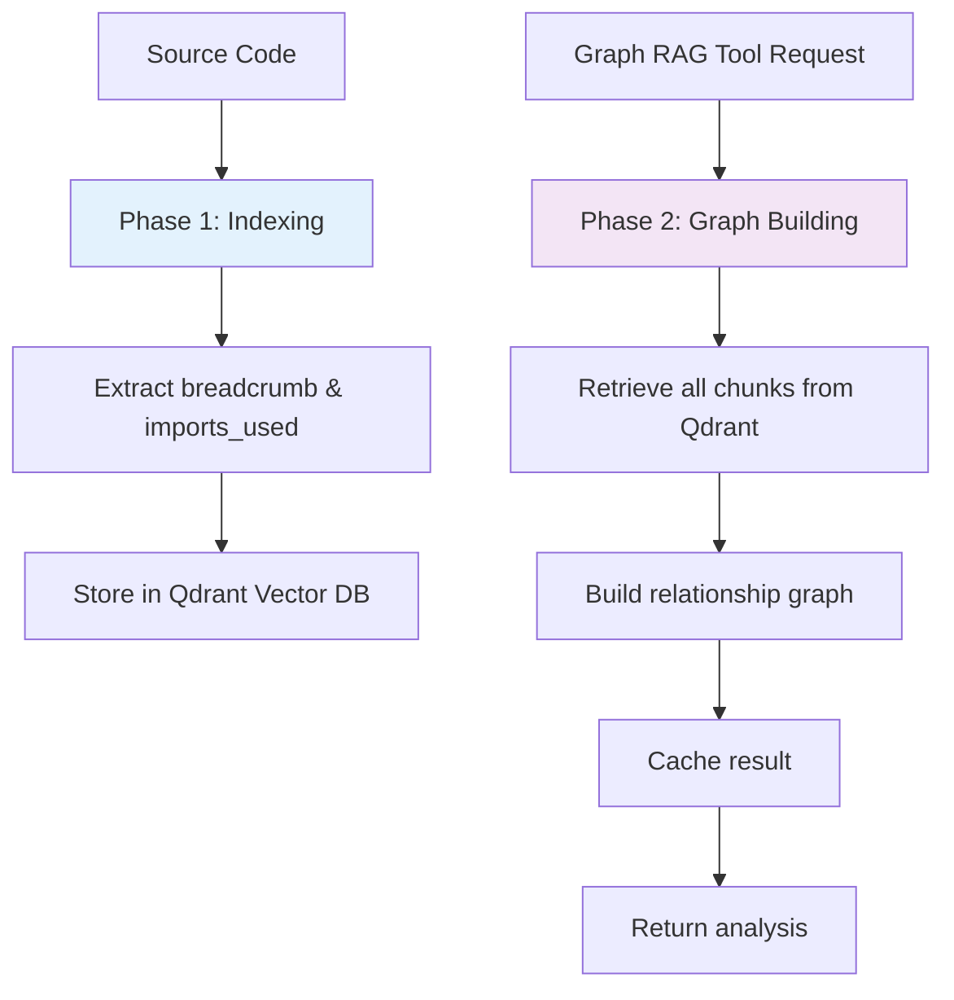

# Graph RAG Architecture Guide

## Overview

This document provides a comprehensive guide to the **Graph RAG (Retrieval-Augmented Generation) architecture** in the Codebase RAG MCP Server. Graph RAG extends the traditional RAG approach by building **code relationship graphs** that capture the structural dependencies and hierarchical relationships between different code components.

## Table of Contents

1. [Core Concepts](#core-concepts)
2. [Architecture Overview](#architecture-overview)
3. [Indexing vs Graph Building](#indexing-vs-graph-building)
4. [Graph Building Process](#graph-building-process)
5. [Breadcrumb and Imports Relationship](#breadcrumb-and-imports-relationship)
6. [Graph RAG Tools](#graph-rag-tools)
7. [Performance Considerations](#performance-considerations)
8. [Developer Guide](#developer-guide)

## Core Concepts

### 🍞 Breadcrumb - Code Identity

A **breadcrumb** is a unique identifier that represents the hierarchical location of a code component within a project:

```
Format: module.file.class.method
Example: "cache.service.RedisCacheService.get_cached_data"
```

### 📦 Imports Used - Dependency Tracking

**imports_used** is a list of external dependencies that a code chunk relies on:

```python
# Example from a Python file:
imports_used = [
    "redis.Redis",
    "json.dumps",
    "asyncio.sleep",
    "src.utils.cache_utils.serialize_data"
]
```

### 🔗 Relationship Graph

The relationship graph connects code components based on their dependencies, creating a network that enables:
- **Dependency Analysis**: Understanding what depends on what
- **Impact Assessment**: Knowing what changes when you modify code
- **Architectural Insights**: Visualizing system structure and patterns

## Architecture Overview

### Two-Phase Architecture

The Graph RAG system uses a **two-phase architecture** to optimize performance:



## Indexing vs Graph Building

### 🏗️ Indexing Phase (Both Manual & MCP Tools)

**Purpose**: Parse code and store structured data for search

**Process**:
1. **File Discovery**: Find relevant source files
2. **AST Parsing**: Use Tree-sitter to parse syntax
3. **Chunk Extraction**: Extract functions, classes, methods
4. **Metadata Extraction**:
   - Extract `breadcrumb` (code location)
   - Extract `imports_used` (dependencies)
   - Extract signatures, docstrings, etc.
5. **Vector Storage**: Convert to embeddings and store in Qdrant

**Key Point**: 🚫 **Graph building does NOT happen during indexing**

### 🔗 Graph Building Phase (On-Demand)

**Purpose**: Build code relationship graphs for analysis

**Triggers**: Only when Graph RAG tools are used:
- `graph_analyze_structure_tool`
- `graph_find_similar_implementations_tool`
- `graph_identify_patterns_tool`

**Process**:
1. **Data Retrieval**: Fetch all chunks from Qdrant
2. **Graph Construction**: Build relationships using `breadcrumb` and `imports_used`
3. **Caching**: Store result for future use
4. **Analysis**: Perform requested analysis on the graph

## Graph Building Process

### Core Function: `build_structure_graph`

Located in `src/services/graph_rag_service.py:107`

```python
async def build_structure_graph(self, project_name: str, force_rebuild: bool = False) -> StructureGraph:
    # 1. Check cache first
    if not force_rebuild and project_name in self._graph_cache:
        return self._graph_cache[project_name]

    # 2. Retrieve all code chunks for the project
    chunks = await self._get_project_chunks(project_name)

    # 3. Build the graph structure
    graph = await self.relationship_builder.build_relationship_graph(chunks, project_name)

    # 4. Cache the result
    self._graph_cache[project_name] = graph

    return graph
```

### Relationship Building Algorithm

Located in `src/services/structure_relationship_builder.py:267`

```python
async def _build_dependency_relationships(self, chunks: list[CodeChunk], nodes: dict[str, GraphNode]) -> list[GraphEdge]:
    """Build dependency relationships based on imports and function calls."""
    edges = []

    for chunk in chunks:
        # 1. Get source location
        source_breadcrumb = chunk.breadcrumb  # e.g., "cache.service.RedisCacheService"

        # 2. Process each import dependency
        if chunk.imports_used:
            for import_name in chunk.imports_used:
                # 3. Resolve import to target breadcrumb
                target_breadcrumb = self._resolve_import_to_breadcrumb(import_name, nodes)

                # 4. Create dependency edge
                if target_breadcrumb and target_breadcrumb != source_breadcrumb:
                    edge = GraphEdge(
                        source_breadcrumb=source_breadcrumb,
                        target_breadcrumb=target_breadcrumb,
                        relationship_type="dependency",
                        weight=0.8,
                        confidence=0.9,
                        metadata={"dependency_type": "import", "import_name": import_name}
                    )
                    edges.append(edge)

    return edges
```

## Breadcrumb and Imports Relationship

### Import Resolution Process

The system converts import names to breadcrumbs using a two-step strategy:

```python
def _resolve_import_to_breadcrumb(self, import_name: str, nodes: dict[str, GraphNode]) -> str | None:
    # Strategy 1: Direct name matching
    for breadcrumb, node in nodes.items():
        if node.name == import_name:  # e.g., "Redis" matches node.name
            return breadcrumb  # Returns "redis.client.Redis"

    # Strategy 2: Partial breadcrumb matching
    for breadcrumb in nodes.keys():
        if import_name in breadcrumb:  # e.g., "Redis" in "redis.client.Redis"
            return breadcrumb

    return None  # Not found
```

### Example: Building Relationships

Given a Redis cache service:

```python
# File: src/services/cache_service.py
import redis
import json
import asyncio
from .base_service import BaseService

class RedisCacheService(BaseService):
    async def get_data(self, key: str):
        # Implementation...
```

**Indexing extracts**:
- `breadcrumb`: `"cache.service.RedisCacheService.get_data"`
- `imports_used`: `["redis.Redis", "json.dumps", "asyncio.sleep", "base.service.BaseService"]`

**Graph building creates**:
```
cache.service.RedisCacheService.get_data → redis.client.Redis
cache.service.RedisCacheService.get_data → json.encoder.dumps
cache.service.RedisCacheService.get_data → asyncio.tasks.sleep
cache.service.RedisCacheService.get_data → base.service.BaseService
```

## Graph RAG Tools

### 🔍 `graph_analyze_structure_tool`

**Purpose**: Analyze the hierarchical structure and relationships of code components

**Key Features**:
- Builds project structure graph
- Analyzes component relationships
- Provides hierarchical insights
- Supports different analysis depths

**Usage**:
```python
result = await graph_analyze_structure_tool(
    breadcrumb="cache.service.RedisCacheService",
    project_name="my-project",
    analysis_type="comprehensive"
)
```

### 🔎 `graph_find_similar_implementations_tool`

**Purpose**: Find similar code implementations across projects

**Key Features**:
- Cross-project similarity search
- Semantic and structural comparison
- Architecture pattern detection
- Implementation chain analysis

**Usage**:
```python
result = await graph_find_similar_implementations_tool(
    query="cache service implementation patterns",
    target_projects=["project1", "project2"],
    similarity_threshold=0.7
)
```

### 🎨 `graph_identify_patterns_tool`

**Purpose**: Identify architectural patterns and design patterns in code

**Key Features**:
- Pattern recognition algorithms
- Architectural analysis
- Design pattern detection
- Code organization insights

**Usage**:
```python
result = await graph_identify_patterns_tool(
    project_name="my-project",
    pattern_types=["architectural", "behavioral"],
    min_confidence=0.6
)
```

## Performance Considerations

### 🚀 Lazy Graph Building

**Benefits**:
- **Faster Indexing**: No graph building overhead during indexing
- **Fresh Data**: Graphs are built from latest indexed data
- **Memory Efficient**: Graphs are built only when needed

### 💾 Caching Strategy

**Multi-level Caching**:
1. **In-memory Cache**: Fast access for recently built graphs
2. **TTL-based Expiration**: Automatic cache invalidation
3. **Force Rebuild**: Option to rebuild graphs when needed

**Cache Keys**:
- Project-level graphs: `project_name`
- Component analysis: `breadcrumb + project_name`
- Traversal results: `breadcrumb + traversal_options`

### 📊 Performance Metrics

The system tracks performance metrics:
- Graph build time
- Cache hit/miss ratios
- Traversal performance
- Memory usage

## Developer Guide

### Adding New Relationship Types

To add new relationship types, extend the `_build_dependency_relationships` method:

```python
# Add to structure_relationship_builder.py
async def _build_custom_relationships(self, chunks: list[CodeChunk], nodes: dict[str, GraphNode]) -> list[GraphEdge]:
    edges = []

    for chunk in chunks:
        # Your custom relationship logic here
        if chunk.some_custom_field:
            # Build custom relationships
            pass

    return edges
```

### Extending Graph Analysis

To add new analysis capabilities:

1. **Add to GraphRAGService**: New analysis methods
2. **Update Tools**: Add new MCP tools
3. **Extend Algorithms**: Add to graph_traversal_algorithms.py

### Debugging Graph Building

**Enable Debug Logging**:
```python
import logging
logging.getLogger("src.services.graph_rag_service").setLevel(logging.DEBUG)
```

**Check Graph Structure**:
```python
# Access graph directly
graph = await graph_rag_service.build_structure_graph("project-name")
print(f"Nodes: {len(graph.nodes)}")
print(f"Edges: {len(graph.edges)}")
```

### Common Issues

1. **Empty Graphs**: Ensure project has been indexed first
2. **Missing Relationships**: Check import resolution logic
3. **Performance Issues**: Monitor cache hit rates
4. **Memory Usage**: Use force_rebuild sparingly

## Best Practices

### 🎯 For Developers

1. **Index First**: Always index your project before using Graph RAG tools
2. **Use Appropriate Tools**: Choose the right tool for your analysis needs
3. **Monitor Performance**: Watch cache hit rates and build times
4. **Handle Errors**: Implement proper error handling for graph operations

### 🏗️ For System Administrators

1. **Cache Management**: Monitor cache sizes and hit rates
2. **Memory Monitoring**: Track memory usage during graph building
3. **Performance Tuning**: Adjust cache TTL based on usage patterns
4. **Error Monitoring**: Set up alerts for graph building failures

### 📈 For Advanced Users

1. **Custom Patterns**: Extend pattern recognition for your specific needs
2. **Cross-Project Analysis**: Leverage multi-project capabilities
3. **Integration**: Integrate with existing development tools
4. **Metrics**: Set up custom metrics for your workflows

## Conclusion

The Graph RAG architecture provides a powerful foundation for understanding code relationships and structure. By separating indexing from graph building, the system achieves optimal performance while providing rich analytical capabilities. The breadcrumb and imports_used relationship system enables precise dependency tracking and architectural analysis.

For more information, see:
- [MCP Tools Reference](MCP_TOOLS.md)
- [Architecture Deep Dive](ARCHITECTURE_DEEP_DIVE.md)
- [Intelligent Chunking Guide](INTELLIGENT_CHUNKING_GUIDE.md)
