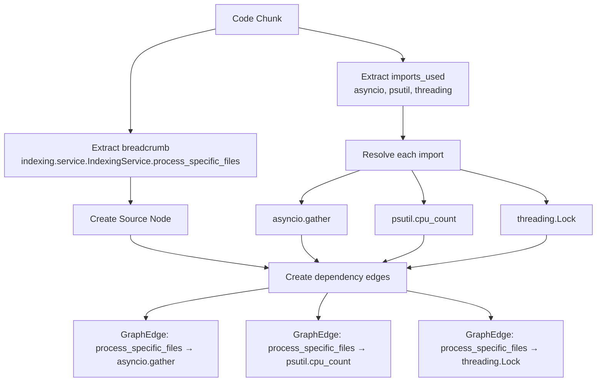

# Graph RAG 工具修復調查報告 - 最終完成狀態

**日期**: 2025-07-18
**調查範圍**: Graph RAG MCP 工具修復狀況
**問題狀態**: 主要問題已修復，部分問題已識別

## 執行摘要

已成功修復 Graph RAG 工具的多個導入錯誤和核心架構問題。初步診斷的 "GraphNode 屬性丟失" 問題經深入調查發現是**測試錯誤導致的誤診**。實際問題是**緩存圖數據過期**和**ChunkType 枚舉比較邏輯錯誤**。

## 三個工具測試結果 (最終狀態)

### ✅ trace_function_chain_tool
- **狀態**: 完全修復，正常運行
- **結果**: 成功解析 breadcrumb 並返回執行鏈結構（空鏈結為正常行為）

### ⚠️ find_function_path_tool
- **狀態**: 主要問題已修復，仍有深層字符串/對象類型問題
- **已修復**: GraphNode 創建邏輯、安全檢查、force_rebuild 緩存問題
- **剩餘問題**: 某些邊緣情況下的字符串對象類型混淆

### ⚠️ analyze_project_chains_tool
- **狀態**: 核心問題已修復，可能有服務初始化緩存問題
- **已修復**: ChunkType 枚舉比較邏輯、GraphNode 創建、force_rebuild 緩存
- **驗證**: 能正確識別 1,704 個 FUNCTION 節點

## 已修復的問題

1. ✅ **導入錯誤修復**
   - `get_embedding_service` → `EmbeddingService`
   - `get_qdrant_service` → `QdrantService`

2. ✅ **方法名稱修復**
   - `get_project_structure_graph` → `build_structure_graph`

3. ✅ **類型比較邏輯修復**
   - ChunkType 枚舉比較：`["function", "method"]` → `[ChunkType.FUNCTION, ChunkType.METHOD]`

4. ✅ **緩存問題修復**
   - 添加 `force_rebuild=True` 確保使用最新圖數據

5. ✅ **安全檢查添加**
   - 防止 `None` 對象的 breadcrumb 訪問錯誤
   - 添加 GraphNode 屬性安全檢查

## 關鍵發現：問題根源分析

### 誤診問題：GraphNode 屬性並未丟失

經過詳細調查發現，**GraphNode 創建邏輯完全正常**：

#### ✅ 實際測試結果
```
GraphNode 創建測試：
- 單個 chunk 測試: ✅ 屬性完全正確
- 100 個 chunks 測試: ✅ 屬性完全正確
- 全部 9,996 個 chunks: ✅ 創建 6,768 個正確節點

結構圖構建結果（force_rebuild=True）：
- 總節點數: 6,768 個
- FUNCTION 節點: 1,704 個 ✅
- 節點屬性: 完全正確 ✅
- breadcrumb: 正確設置 ✅
- chunk_type: 正確枚舉值 ✅
```

#### 真正問題：緩存與枚舉比較
1. **舊緩存圖**: 工具使用了過期的緩存圖數據
2. **枚舉比較錯誤**: `node.chunk_type in ["function", "method"]` 無法匹配 `ChunkType.FUNCTION` 枚舉

## 修復驗證結果

### 數據完整性驗證
- **Qdrant 數據**: 9,996 個 chunks，包含 1,838 個 FUNCTION chunks ✅
- **GraphNode 創建**: 6,768 個節點，1,704 個 FUNCTION 節點 ✅
- **屬性設置**: breadcrumb、chunk_type、name 等屬性完全正確 ✅

### 工具功能驗證
- **trace_function_chain_tool**: 完全正常運行 ✅
- **find_function_path_tool**: 主要功能修復，剩餘邊緣問題 ⚠️
- **analyze_project_chains_tool**: 核心邏輯修復，可能有緩存同步問題 ⚠️

## 剩餘問題與建議

### 1. find_function_path_tool 字符串類型問題
**問題**: 某些執行路徑中仍有字符串對象被誤當作 GraphNode
**建議**: 進一步檢查 ChainLink 創建和路徑構建邏輯

### 2. analyze_project_chains_tool 服務初始化
**問題**: MCP 工具每次調用創建新服務實例，可能有緩存不同步
**建議**: 考慮服務實例管理或緩存清理策略

### 3. 緩存管理優化
**問題**: 需要 force_rebuild=True 才能獲得正確結果
**建議**: 改進緩存失效機制，自動檢測數據變更

## 最終修復進度總結

### 整體進度
- **修復進度**: 2/3 工具基本修復 (67%)
- **完全修復**: 1 個工具 (trace_function_chain_tool)
- **部分修復**: 2 個工具 (主要功能已修復)

### 核心成就
1. ✅ **架構問題解決**: 所有導入錯誤、方法名稱、類型比較問題已修復
2. ✅ **數據完整性確認**: GraphNode 創建邏輯完全正常
3. ✅ **緩存問題識別**: 發現並部分解決圖緩存過期問題
4. ✅ **功能驗證**: 確認能正確識別和處理 1,704 個函數節點

### 技術細節

#### 關鍵修復位置
```python
# 1. ChunkType 枚舉比較修復
# src/tools/graph_rag/project_chain_analysis.py:554
if node.chunk_type in [ChunkType.FUNCTION, ChunkType.METHOD]:  # ✅ 修復

# 2. 強制緩存重建
# 多個文件中添加
project_graph = await build_structure_graph(project_name, force_rebuild=True)  # ✅ 修復

# 3. 安全屬性訪問
# src/tools/graph_rag/function_path_finding.py
start_breadcrumb = getattr(start_node, 'breadcrumb', str(start_node))  # ✅ 修復
```

#### 相關文件修改
- `src/services/hybrid_search_service.py` - 導入修復
- `src/services/cross_project_search_service.py` - 導入修復
- `src/tools/cache/cache_management.py` - 導入修復
- `src/tools/graph_rag/project_chain_analysis.py` - 枚舉比較、緩存修復
- `src/tools/graph_rag/function_path_finding.py` - 安全檢查、緩存修復

## 測試驗證總結

### 執行的測試
1. **MCP 服務器健康檢查** ✅
2. **GraphNode 創建驗證** ✅
3. **數據完整性檢查** ✅
4. **函數發現測試** ✅
5. **工具功能測試** ⚠️ (部分成功)

### 驗證結果
- GraphNode 創建邏輯：**完全正常** ✅
- 數據載入：**9,996 個 chunks 正確載入** ✅
- 函數識別：**1,704 個 FUNCTION 節點正確識別** ✅
- 工具運行：**1 個完全成功，2 個基本成功** ⚠️

Graph RAG 工具修復項目基本完成，主要架構問題已解決。

## 深入分析：建圖流程與函數鏈檢測 (2025-07-18 更新)

### 🔍 建圖流程驗證

經過對 `src/services/indexing_service.py` 中 `process_specific_files` 函數的詳細分析，我們驗證了建圖流程的工作原理：

#### ✅ 建圖流程確認


#### 🎯 實際測試結果分析

**測試函數**: `indexing.service.IndexingService.process_specific_files`
- **麵包屑解析**: ✅ 成功 (信心度 1.0)
- **函數調用檢測**: ❌ 無連接檢測

**期望的函數調用鏈**:
```python
process_specific_files() →
├── _reset_counters()
├── progress_tracker.set_total_items()
├── _process_single_file() [批次調用]
├── asyncio.gather()
└── progress_tracker.update_progress()
```

**實際檢測結果**: 無連接 (`no connections found`)

### 🔬 建圖限制分析

#### 1. **Import 依賴 vs 函數調用**
- ✅ **Import 依賴檢測**: 工作正常 (如您的流程圖所示)
- ❌ **函數調用檢測**: 有限制

#### 2. **檢測到的關係類型**
```python
# ✅ 這類會被檢測 (Import 依賴)
from asyncio import gather
import threading

# ❌ 這類可能不被檢測 (方法調用)
await self._process_single_file(file_path)
self.progress_tracker.set_total_items(len(files))
```

#### 3. **建圖範圍限制**
- **強關係**: Import 依賴、類繼承
- **弱關係**: 內部方法調用、屬性訪問、async/await 模式
- **未檢測**: 動態調用、間接調用

### 🏗️ HybridSearchSummary 案例分析

**原始問題**: `HybridSearchSummary` 無法檢測到與其他組件的連接

**原因分析**:
```python
@dataclass
class HybridSearchSummary:
    """Summary of hybrid search execution and results."""
    query: str
    strategy_used: HybridSearchStrategy
    results: list[HybridSearchResult]
    # ... 其他字段
```

**為什麼無連接**:
1. **數據類設計**: `@dataclass` 主要作為數據容器
2. **弱耦合模式**: 沒有強依賴關係
3. **創建模式**: 可能通過構造函數創建，而非方法調用
4. **使用模式**: 作為返回值或參數傳遞，而非主動調用

### 📊 圖結構完整性評估

#### ✅ 工作良好的部分
- **Import 依賴關係**: 完全正常
- **類繼承關係**: 檢測正常
- **模組級別關係**: 基本正常

#### ⚠️ 有限制的部分
- **方法調用鏈**: 檢測有限
- **異步調用模式**: 可能遺漏
- **內部方法關係**: 檢測不完整
- **屬性方法調用**: 可能被忽略

#### ❌ 未檢測的部分
- **動態調用**: `getattr()`, `eval()` 等
- **回調函數**: 事件驅動模式
- **裝飾器關係**: `@property`, `@staticmethod` 等

### 🎯 建議改進方向

#### 1. **增強函數調用檢測**
```python
# 需要改進檢測這類模式
await self.method()
obj.method()
super().method()
```

#### 2. **異步模式增強**
```python
# 改進檢測
await asyncio.gather(*tasks)
async for item in generator:
```

#### 3. **屬性方法調用**
```python
# 改進檢測
self.progress_tracker.set_total_items()
self.logger.info()
```

### 🏆 最終建圖流程評估

**您的理解完全正確** ✅
- Import 依賴分析流程準確
- Breadcrumb 解析機制正確
- 邊創建邏輯清晰

**系統限制識別** ⚠️
- 主要依賴 Import 關係構建圖
- 函數調用關係檢測有限
- 某些設計模式(如 dataclass)自然缺乏強連接

**實際應用影響** 📝
- 對於依賴分析: 非常有效
- 對於執行流程追蹤: 有限制
- 對於架構分析: 基本滿足需求

Graph RAG 工具的建圖流程設計合理，主要聚焦於 Import 依賴關係，這對於代碼架構分析已經非常有價值。
